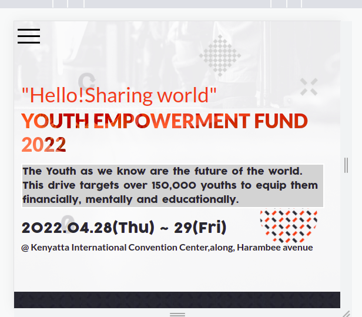
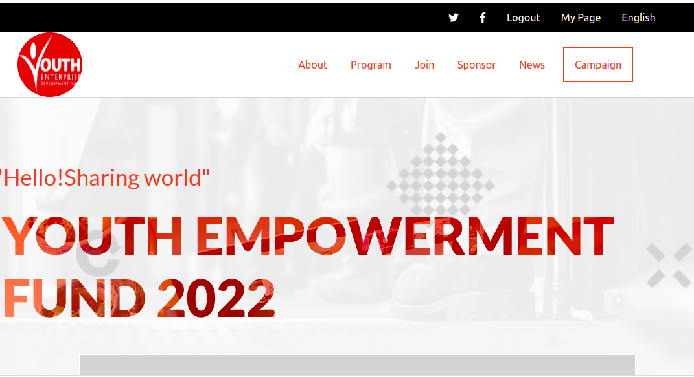

# Youth Fund Drive Page
This project aims at notifying the youths and various sponsors on the upcoming fund drive. The conference aims to raise money and also brainstorm ways to advance the youths educationally, mentally and financially. Users can always be notified on such events.

## Contents
- Development
- Screen Shots
- Visit Website
- Built With
- Live Demo
- Contributors
- Author

## Development

The project was initialised using Html and CSS.

The mobile interaction Menu was set up using Javascript manipulation of elements.

The Speaker section was dynamically set up using Javascript.

Images were installed to bring out the aim of the project.

## Screen Shots 

## Visit Website
[GitHub pages](https://kwambiee.github.io/Youth-Fund-Drive/)

## Built With 
- HTML
- CSS
- Git & Gitflow
- Javascript
- Github pages for deployment

## Live Demo

## Contributors
Original design by [Cindy Shin](https://www.behance.net/adagio07)

:bust_in_silhouette: **Author**

   ## Joy Kwamboka

- Github: [@kwambiee](https://github.com/kwambiee)
- Twitter: [@kwambiee](https://twitter.com/kwambiee)
- Linkedin: [Joy Kwamboka](https://www.linkedin.com/in/joy-kwamboka)
- E-mail: kwambokaj2.jk@gmail.com

